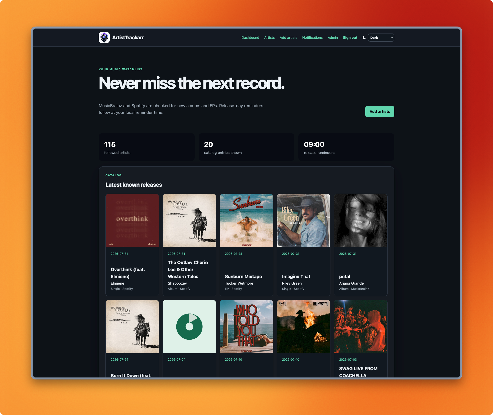

# ArtistTrackarr

A self-hosted household dashboard that watches Spotify for new albums, EPs, singles, and compilations,
using MusicBrainz for stable artist identity with Apple/iTunes fallback observations,
public ListenBrainz artist popularity, and sends announcement and release-day notifications through
[Shoutrrr](https://containrrr.dev/shoutrrr/).

## Example dashboard

The following screenshot shows how ArtistTrackarr can look in a production
deployment:



## Quick start

1. Copy `.env.example` to `.env` and set `SETUP_TOKEN`,
   `APP_ENCRYPTION_KEY`, and `SESSION_SECRET`. Each secret should be a random
   value of at least 32 characters.
2. Set `MUSICBRAINZ_CONTACT` to a real email address or project URL.
3. Start the application:

   ```console
   docker compose pull
   docker compose up -d
   ```

4. Open `http://localhost:8080/setup`, enter `SETUP_TOKEN`, and create the
   first administrator with a unique username.

Application data remains on the existing Compose volume mapping so upgrades do
not move user data. Docker Compose names the container `artist-trackarr` for
predictable logs and administration commands. Use the backup helper below to
resolve the project-prefixed volume mounted at `/data`; do not guess its Docker
volume name.

Release-group artwork follows a validated cascade: Spotify artwork first,
then direct Apple/iTunes artwork, then Cover Art Archive artwork for real
MusicBrainz IDs, and finally a local placeholder. Apple artwork is loaded
directly by the browser and is never stored, cached, or proxied by the app;
the dashboard labels it with Apple attribution and an Apple Music link. A
bounded background backfill gradually fills artwork on existing iTunes
releases without creating releases or notifications.

Use the moon/sun button in the header to switch between light and dark mode;
your choice is remembered in the browser.
The running application version and project repository are available in the
footer. The current release is `v0.39.0`; release images display the injected
semantic version while local builds identify themselves as `dev`. Operational
timestamps are stored
in UTC and rendered in the configured system timezone; existing databases are
normalized automatically during the v0.20.0 migration.

Background synchronization and application-log persistence shut down in an
orderly fashion before SQLite is closed. Routine page loads return a generic
error when a data lookup fails, while the detailed cause remains in structured
logs. Static assets use immutable, version-stamped URLs and continue to serve
their unversioned paths for compatibility.

The v0.39.0 operational-confidence release adds checksum-protected backups,
restore state verification, pinned Docker helper images, an authenticated
container smoke rehearsal, and freshness-aware provider health reporting. The
v0.38.0 hardening release adds paused-destination admission, credit-aware
owner visibility, atomic migration recovery, connection-time notification
target checks, and a volume-resolving backup workflow. These controls keep
manual work from starving scheduled synchronization or the SQLite writer while
preserving the existing routes and notification behavior.

The v0.36.0 hardening release tightened startup validation, request handling,
build identity, and operational safety without changing release semantics. The
previous reliability work also recovers from panics in scheduled and delivery
work, applies persisted MusicBrainz cooldowns with bounded provider retries,
and bounds provider caches and catalog pagination so unusually large catalogs
cannot exhaust memory or silently apply incomplete results. ListenBrainz
retries transient responses with the ArtistTrackarr User-Agent and keeps prior
aggregate values when a response omits an artist; Cover Art Archive failures
retain stale artwork or the local placeholder without negative-caching
transient outages.

The v0.23.0 hardening defaults keep setup and login attempts bounded, accept
forwarded client addresses only from explicitly trusted proxy networks, and
redact notification destination credentials from delivery errors. Notification
targets that resolve to loopback, private, link-local, metadata, shared, or
reserved networks are blocked by default; enable
`ALLOW_PRIVATE_NOTIFICATION_TARGETS` only for a trusted household that needs a
local notification service.

The Artists page uses 50-item, page-number navigation for followed artists.
Genre, country, artist-type, and search filters remain in the page URL while
browsing, and the watchlist total stays separate from the filtered result count.

The **Release calendar** gives each member a timezone-aware view of precise,
day-dated releases from their followed artists. Calendar entries retain source
confidence, review/hold state, and links to the internal release details page;
the authenticated ICS export contains the next year of releases and can be
subscribed to by a calendar application. Partial and unknown dates are kept
out of the export rather than being assigned a misleading day.

Settings can optionally queue a daily or weekly upcoming-release digest at the
member's existing reminder time. Digest runs are deduplicated per local period,
use the same encrypted destinations and bounded retry policy as normal
notifications, and are disabled by default. They are informational only and
never create release events or alter provider polling.

The **Release Trust Center** summarizes per-artist provider coverage. It shows
when Spotify, Apple/iTunes, or MusicBrainz last returned data, whether releases
are confirmed by multiple sources or currently rely on a fallback, provider
cooldowns, and the next scheduled check. Use **Sync now** for a followed artist
to queue the normal provider strategy; it does not bypass rate limits or alter
notification deduplication.

The dashboard and Trust Center also include **Watchlist assurance**. Each
followed artist is classified as healthy, delayed, degraded, or pending from
recent provider outcomes and release history; the dashboard surfaces the most
important gaps first without exposing provider credentials or payloads. Admins
can open **System diagnostics** or download a redacted support report with
database, scheduler, queue, and provider-status counters. The report is safe
to share because it excludes destination URLs, credentials, notification
bodies, and provider error text.

The **Release inbox** keeps one owner-scoped entry for each alertable release.
It shows the latest announcement or release-day event, provider confidence,
observation history, and source links even when a notification destination was
offline. Members can mark entries read, snooze them for one or seven days, or
dismiss and restore them. Historical releases silently baselined during an
initial sync do not appear, and inbox state never changes notification
delivery or provider polling.

The **Release Truth Desk** highlights disagreements between the latest Spotify,
Apple/iTunes, and MusicBrainz observations for a release, as well as releases
that have multiple fallback observations without canonical confirmation. Open
issues are visible from the Trust Center, dashboard, and release details. Each
household member can confirm, snooze, dismiss, or restore an issue privately;
review actions never change canonical release metadata, notifications, or
provider polling. Evidence is normalized to provider, title, type, date, and
link fields; raw provider payloads and credentials are never stored. Issues are
created or refreshed during normal synchronization, so existing records appear
after their next provider check. Release details also expose a reversible Truth
Loop decision: members can explicitly confirm the provider that best represents
a release for their household without rewriting provider observations.

The optional **Release Trust Guard** builds on the Truth Desk. Enable “Hold
notifications when provider evidence conflicts” under Settings to keep alerts
with warning or critical date, title, or type disagreements out of the delivery
queue. Held alerts appear on the dashboard and release details, where a member
can confirm a provider, notify anyway, or discard the alert. The default remains
immediate delivery, and informational gaps such as a missing canonical
observation do not block notifications.

Release details include a **Release Assurance Timeline**. This owner-scoped,
redacted view explains when each provider observed a release, which primary,
featured, or guest credits were recorded, how evidence reviews and household
truth decisions changed confidence, and whether notifications were held,
queued, sent, or failed. It is derived from existing observations and audit
projections; provider payloads, credentials, and notification bodies are never
shown or stored in the timeline. The inbox links directly to this explanation
for each alert.

The scheduler checks due synchronization and release-day work once per minute,
delivers notifications every ten seconds, and runs transient-state maintenance
hourly. Hourly maintenance also bounds the artwork cache to 1 GiB or 25,000
files, removing stale and oldest entries first. Notification delivery is
scheduled through a bounded four-worker queue, while the Shoutrrr 0.8
compatibility adapter serializes the underlying HTTP client send and restores
the process default after each operation. SQLite keeps one serialized writer
and a small read-only pool so dashboard queries do not queue behind provider
work.

Delivery assurance records every normal and digest attempt, keeps a durable
health state for each destination, and pauses destinations after five
consecutive failures. Settings shows the latest failure and provides an
owner-scoped retry action; administrators can see household-wide destination
health and pending/failed queue counts. HTTP notification transports use a
bounded timeout and re-check every redirect against the outbound-target safety
policy. Message bodies and encrypted destination URLs are never stored in the
health projection.

Each followed artist can also have an owner-scoped notification rule. Use the
artist list to keep an artist on the account defaults, deliver only through
the immediate queue, include them only in the configured digest, or turn their
notifications off while retaining the release in the inbox. Rules can narrow
alerts to primary or featured credits and to albums, EPs, singles, or
compilations, and a follow can be paused for seven days. Existing account-wide
notification preferences remain the defaults for follows using **Account
defaults**; provider polling and release history are never changed by a rule.
The artist page also supports applying a delivery mode to up to 50 selected
follows at once.

When `PUBLIC_URL` uses HTTPS, the application sends HSTS and a restrictive
Permissions-Policy header. With `LOG_LEVEL=debug`, sanitized request-completion
records include the request ID, route pattern, status, duration, and response
size; request paths, query strings, bodies, credentials, and destination URLs
are never logged.

## Container images

GitHub Actions builds and publishes the Docker image to
`ghcr.io/crypt0rr/artist-trackarr` for `linux/amd64` and `linux/arm64`.

- `latest` and `main` follow the current `main` branch.
- `sha-<commit>` identifies an exact source revision.
- Pushing a tag such as `v0.39.0` publishes `0.39.0`, `0.39`, and `latest`.

Release images receive their version through the Docker build's `APP_VERSION`
argument. Tag builds inject the semantic tag (without the leading `v`), while
branch and local builds use `dev` or `dev-<short-sha>` so development images are
not confused with a release.

Pin a deployment to a release by setting the Compose image before starting:

```console
ARTIST_TRACKARR_IMAGE=ghcr.io/crypt0rr/artist-trackarr:0.39.0 docker compose up -d
```

## Configuration

| Variable | Required | Default | Description |
| --- | --- | --- | --- |
| `PUBLIC_URL` | yes | `http://localhost:8080` | External base URL; use HTTPS behind a reverse proxy. |
| `ARTIST_TRACKARR_BIND` | no | `127.0.0.1` | Host address for the Compose port; expose wider only behind a trusted TLS proxy/firewall. |
| `SETUP_TOKEN` | first run | — | Protects initial administrator creation. |
| `APP_ENCRYPTION_KEY` | yes | — | Encrypts notification credentials at rest. |
| `SESSION_SECRET` | yes | — | Adds server-side protection to session cookies. |
| `MUSICBRAINZ_CONTACT` | yes | — | Contact included in the required MusicBrainz User-Agent. |
| `POLL_INTERVAL` | no | `6h` | Catalog polling interval; values below one hour are rejected. |
| `SPOTIFY_POLL_INTERVAL` | no | `24h` | Independent Spotify observation interval; values below one hour are rejected. |
| `SPOTIFY_CLIENT_ID` | no | — | Enables Spotify-first artist discovery. |
| `SPOTIFY_CLIENT_SECRET` | no | — | Spotify application secret. |
| `SPOTIFY_MARKET` | no | `US` | Two-letter market used when retrieving Spotify releases. |
| `ITUNES_MARKET` | no | `US` | Two-letter Apple/iTunes storefront used for fallback searches and release lookups. |
| `DATABASE_PATH` | no | `/data/artist-tracker.db` | SQLite database location. |
| `LISTEN_ADDR` | no | `:8080` | HTTP listen address. |
| `TRUST_PROXY` | no | `false` | Trust `X-Forwarded-For` only when the connecting proxy matches `TRUSTED_PROXY_CIDRS`. |
| `TRUSTED_PROXY_CIDRS` | no | — | Comma-separated proxy networks, for example `127.0.0.1/32,10.0.0.0/8`; required when `TRUST_PROXY=true`. |
| `ALLOW_INSECURE_HTTP` | no | `false` | Explicitly permits a non-local HTTP `PUBLIC_URL`; use only on a trusted, isolated network. |
| `ALLOW_PRIVATE_NOTIFICATION_TARGETS` | no | `false` | Explicitly permits ntfy/Gotify/SMTP/webhook destinations resolving to private networks. |
| `LOG_LEVEL` | no | `info` | JSON log threshold: `debug`, `info`, `warn`, or `error`. |
| `TZ` | no | `UTC` | Container/system timezone for runtime logs and local process time, e.g. `Europe/Amsterdam`. |

Every secret also supports Docker's `*_FILE` convention, for example
`APP_ENCRYPTION_KEY_FILE=/run/secrets/encryption_key`.

## Spotify, Apple/iTunes, and MusicBrainz discovery and release observation

Create an application in the [Spotify developer dashboard](https://developer.spotify.com/dashboard),
then set `SPOTIFY_CLIENT_ID` and `SPOTIFY_CLIENT_SECRET`. When configured,
Spotify supplies the preferred artist search, images, links, and release observation feed. When Spotify is unavailable or returns no results, the application falls back to the public Apple iTunes Search API and then MusicBrainz. MusicBrainz remains the stable artist identity source. Spotify- and iTunes-only releases are stored under their stable provider identity and can generate notifications immediately; they are promoted to a MusicBrainz release group later when a conservative title, type, and date match is found.

Set `SPOTIFY_MARKET` to the country whose catalogue should be checked, for
example `NL`. Existing followed artists are silently baselined the first time
Spotify release polling runs after an upgrade, preventing back-catalogue
notification floods. New releases observed after that baseline can notify
independently of MusicBrainz. Albums, EPs, singles, and compilations are all eligible release
types; multi-track Spotify releases with at least four tracks are treated as
EPs. Spotify also requests the `appears_on` relationship, so a followed artist
is notified when they are featured on another artist's album, EP, single, or
compilation. Existing follows receive a one-time appearance baseline during
their first successful post-upgrade Spotify sync; new followers retain the
normal single-release onboarding notification. Featured alerts represent the
containing release rather than individual tracks.

ArtistTrackarr also keeps a source-agnostic credit graph for followed artists.
Spotify's `appears_on` results, iTunes multi-artist song credits, and
MusicBrainz recording artist credits are normalized into primary, featured, and
guest evidence for the containing release. A guest credit includes its track
context where the provider supplies one, while notifications remain one
release-level event and continue to use the existing deduplication and
baseline rules. Existing follows are baselined once per provider and credit
role so an upgrade cannot flood the inbox with historical collaborations;
newly observed future or recent guest releases are eligible for the normal
announcement and release-day reminders. Follow rules that include featured
appearances also include guest credits.

To keep Spotify Development Mode usage low, release observation normally reads
the newest Spotify artist-albums page and only walks older pages when the stored
Spotify release history has not yet been reached. Known release IDs, dates, and
provider observations are retained locally, and successful release responses
are cached for 24 hours. Artist searches are cached briefly (with identical
in-flight searches coalesced), and artist metadata is cached for 24 hours; this
also means selecting an artist directly from a recent search does not trigger a
second lookup request. Batch follow actions use Spotify's multiple-artist
endpoint when available. Artists are assigned stable polling offsets so a large
watch list is spread across the day instead of queried in one burst.
Apple/iTunes release observations are best-effort and are matched by canonical artist name. Collections are classified as Album, EP, or Single using track-count/title heuristics. Apple artwork URLs are accepted only from Apple hosts, loaded directly with attribution, and never downloaded or retained as image bytes. Existing artwork gaps are backfilled one artist at a time using the same conservative limiter. MusicBrainz release polling remains the final fallback and does not override successful Spotify or iTunes observations.

iTunes requests are serialized to approximately one request every three seconds and successful responses are cached. The storefront follows `ITUNES_MARKET` (default `US`) independently of Spotify, and no Apple credentials are required. The [iTunes Search API](https://developer.apple.com/library/archive/documentation/AudioVideo/Conceptual/iTuneSearchAPI/Searching.html) recommends keeping usage around 20 requests per minute, so iTunes remains a conservative fallback rather than a high-volume source.

Successful Spotify checks also adapt per artist. A catalog change returns the
artist to the configured `SPOTIFY_POLL_INTERVAL`; unchanged artists back off
progressively up to seven days, while artists with upcoming releases stay on the
baseline interval. The backoff state is stored in SQLite and survives restarts.
Spotify rate-limit cooldowns are stored at provider level as well, so a quota
response suppresses background and search requests until the safe retry time
even if the container is restarted.

Selections that cannot be identified while MusicBrainz is unavailable remain
pending and retry automatically.

Spotify Development Mode currently requires the application owner to have an
active Premium subscription and limits new applications to five authorized
users. No Spotify user login is required for this application's
client-credentials search and release-observation flow.

## Artist management

The **Artists** page combines individual search, multi-select following,
watchlist export, and ArtistTrackarr CSV import. An export can be uploaded
unchanged for a round trip: the six exported columns are required (in any
order), while unknown future columns are ignored. Imports are limited to 1 MiB
and 500 data rows, validate canonical MusicBrainz and optional Spotify
identities locally, and process rows independently. Added rows are followed
and scheduled for the normal baseline sync; invalid rows remain visible in the
owner-only import results page and do not prevent valid rows from being
applied. At most two uploads are processed concurrently and manual sync work
is admitted through a bounded queue, so large imports cannot starve scheduled
work or the SQLite writer. Provider calls are never made during the upload
request.

The account menu shows each member's unique username and links to personal
Settings, where they can update their username, timezone, release-day reminder
time, notification preferences, and all notification destinations. The old
`/destinations` address redirects to Settings for compatibility, while
household account administration remains restricted to the Admin page.

Usernames are case-insensitive, 3–32 characters, and may contain letters,
numbers, dots, underscores, and hyphens. Existing accounts receive a
deterministic username during the v0.16.0 migration and can change it later.

Public [ListenBrainz popularity](https://listenbrainz.readthedocs.io/en/latest/users/api/popularity.html) is refreshed once per day for followed canonical
artists. Artist pages show aggregate listen and listener counts when available;
these statistics are informational only and never create release observations
or notifications. The dashboard and Artists page also provide compact
breakdowns by genre, country, and artist type with owner-scoped drill-down
filters. Genres come from MusicBrainz tags and are normalized locally.

## Notification destinations

Users can add guided Email, Discord, Telegram, ntfy, Gotify, and generic
webhook destinations. Any service supported by Shoutrrr can be added with its
raw service URL. Credentials are encrypted in SQLite and redacted from the UI
and logs. Use the **Send test** action after adding a destination.

Users can choose whether albums, EPs, singles, announcements, and release-day
reminders should be delivered. Followed artists show their last and next
synchronization times, and **Sync now** queues a rate-limited refresh. Release
details expose the stored provider observations and source history.

Expired sessions and authentication tokens are removed during periodic state
maintenance. Login-attempt records older than 24 hours and completed or failed
manual sync requests older than 30 days are removed. Import jobs older than 30
days (including their rows) are removed; notification and delivery history is
retained, application logs keep their existing seven-day window, and recent
queued work is not deleted.

## Household administration

Administrators can review every household account, its role, reminder settings,
follow count, and notification-destination count. They can permanently delete
another user and all of that user's private data. Administrators cannot delete
their own account or leave the household without an administrator.

## Reverse proxy and backups

Terminate TLS at Caddy, Traefik, nginx, or another reverse proxy and set
`PUBLIC_URL` to its HTTPS address. Non-local HTTP is rejected unless
`ALLOW_INSECURE_HTTP=true` is explicitly set. To preserve accurate login
throttling, set `TRUST_PROXY=true` together with the proxy's exact
`TRUSTED_PROXY_CIDRS`; forwarding headers from an untrusted connection are
ignored.

Notification destinations are server-side outbound requests. By default,
ArtistTrackarr blocks loopback, private, link-local, multicast, and metadata
network addresses to prevent an invited user from using notifications as an
SSRF proxy. Set `ALLOW_PRIVATE_NOTIFICATION_TARGETS=true` only when all
household members are trusted and local notification services are required.

For a consistent backup, use the repository helper. It stops the app, resolves
the volume actually mounted at `/data`, refuses missing or empty databases, and
always attempts to restart the service. The archive contains the complete
persistent data directory and is accompanied by a restrictive-permission
`.sha256` sidecar. Keep the archive and sidecar together:

```console
./scripts/backup.sh artist-trackarr-backup.tgz
```

Restore into an empty Compose volume while the app is stopped, keep the
original `APP_ENCRYPTION_KEY` available, and run the temporary restore
rehearsal before replacing production data. The key is required to decrypt
existing notification destinations. Embedded migrations run automatically
during upgrades; the rehearsal must pass SQLite foreign-key checks and
`/readyz` before the restored instance is considered usable.

The rehearsal verifies the checksum sidecar when present, fingerprints the
durable database state, and compares that fingerprint after a clean restart. A
mismatch fails the rehearsal rather than declaring the restore usable. Legacy
archives without a sidecar are accepted with a warning; new backups should
always retain both files.

The rehearsal uses an isolated Docker volume, starts the selected image,
stops it with the configured grace period, and starts it again to verify that
the restored data remains usable:

```console
APP_ENCRYPTION_KEY="$APP_ENCRYPTION_KEY" \
  ARTIST_TRACKARR_IMAGE=ghcr.io/crypt0rr/artist-trackarr:0.39.0 \
  ./scripts/restore-smoke.sh artist-trackarr-backup.tgz
```

## Development

The test suite runs in the pinned Go toolchain from the build image:

```console
docker build --target test .
```

To measure statement coverage for the internal packages locally:

```console
make coverage
```

The command writes the temporary `coverage.out` profile (ignored by Git) and
prints the combined percentage from `go tool cover`. It enforces an 80% minimum
by default; use `make coverage COVERAGE_MIN=85` to test a stricter local target.

To build and run the current checkout instead of the published image:

```console
docker build -t artist-trackarr:local .
ARTIST_TRACKARR_IMAGE=artist-trackarr:local docker compose up -d
```

The CI-equivalent lifecycle rehearsal can be run against a locally built image.
It creates a temporary volume, completes setup and login, verifies a persisted
follow and manual sync, checks readiness, and confirms clean shutdown/restart:

```console
docker build -t artist-trackarr:ci .
./scripts/container-smoke.sh artist-trackarr:ci
```

No Node.js toolchain or external asset CDN is required.

## License

- Licensed under the [MIT License](LICENSE).
